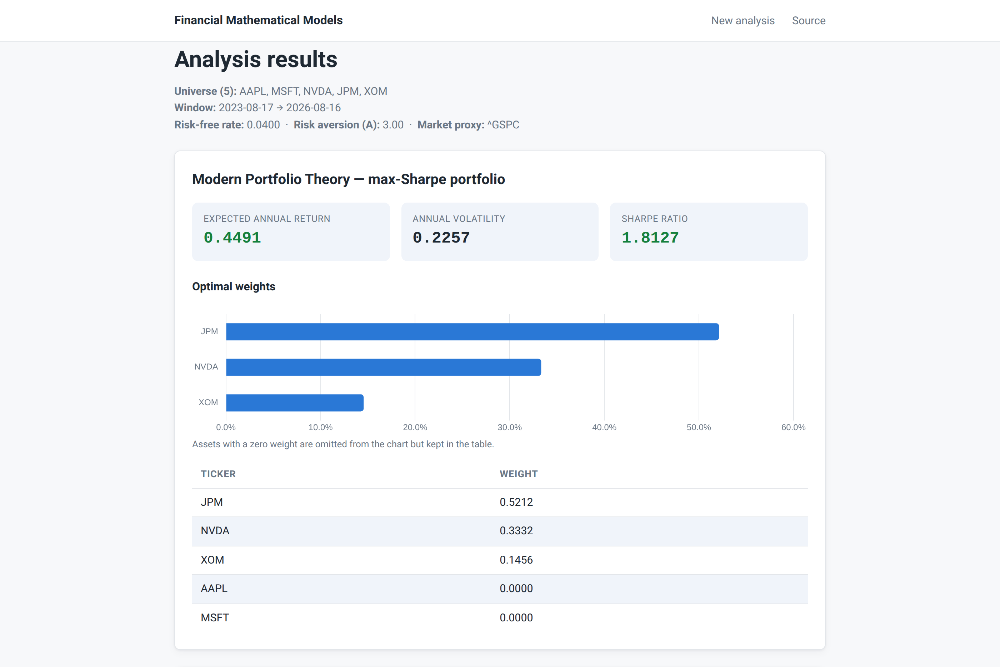

# Financial Mathematical Models

Classic mathematical-finance models — Modern Portfolio Theory, the Single Index Model,
mean-variance utility, and historical VaR/CVaR — as a typed Python library, a set of
demo notebooks, and a Flask web app.

[](https://github.com/nickkats1/Financial-Mathematical-Models/actions/workflows/build_deploy.yaml)
[](pyproject.toml)
[](pyproject.toml)
[](https://github.com/astral-sh/ruff)
[](pyproject.toml)
[](LICENSE)

<picture>
  <source media="(prefers-color-scheme: dark)" srcset="docs/screenshot-dark.png">
  
</picture>

## Highlights

- Every model takes a `pandas.DataFrame` of closing prices and returns plain floats,
  `pd.Series`, or dicts — no framework types leak in or out.
- Use it three ways: import `portfolio` as a library, read the [notebooks](#notebooks)
  for the theory, or run the web app and analyse a ticker universe interactively.
- The test suite is fully offline — every yfinance call is mocked — and runs in seconds
  with a 97% branch-coverage floor.
- Market data is flaky, so the data layer plans for it: prices are cached, transport
  errors are retried, and tickers Yahoo silently drops are surfaced in a banner instead
  of vanishing from the results.

## Quick start

Requires Python 3.11+.

```bash
git clone https://github.com/nickkats1/Financial-Mathematical-Models.git
cd Financial-Mathematical-Models
python -m venv venv
source venv/bin/activate
pip install -e '.[dev]'
```

The editable install is required: the code lives in `src/portfolio/` but imports as
`portfolio`. Add `'.[notebooks]'` for jupyter, matplotlib, seaborn, scipy, and statsmodels.

```python
from portfolio.data import DataIngestion, compute_returns
from portfolio.models import SingleIndexModel, get_risk_metrics, portfolio_metrics

data = DataIngestion(start_date="2022-01-01", end_date="2025-01-01")
prices = data.fetch_prices(["AAPL", "MSFT", "NVDA", "^GSPC"])
assets = prices[["AAPL", "MSFT", "NVDA"]]

mpt = portfolio_metrics(assets, risk_free_rate=0.04)
print(mpt["sharpe_ratio"], mpt["weights"])

risk = get_risk_metrics(assets)          # {0.90: (VaR, CVaR), 0.95: ..., 0.99: ...}

sim = SingleIndexModel()
sim.get_models(["AAPL", "MSFT", "NVDA"], "^GSPC", compute_returns(prices))
print(sim.get_betas())
```

`DataIngestion` also ships preset universes — `get_asset_class_prices("stocks")` (or
`"etfs"`, `"bonds"`, `"crypto"`) — defined in `src/portfolio/config.py`.

## The models

| Model | Function(s) | What it computes |
| --- | --- | --- |
| Modern Portfolio Theory | `portfolio_metrics` | Max-Sharpe portfolio (long-only, fully invested) via [PyPortfolioOpt](https://github.com/robertmartin8/PyPortfolioOpt): expected annual return, volatility, Sharpe ratio, cleaned weights |
| Value at Risk | `get_var`, `get_cvar`, `get_risk_metrics` | Historical (non-parametric) VaR and CVaR; `get_risk_metrics` returns the 90/95/99% levels in one pass |
| Mean-variance utility | `get_utility`, `max_utility` | Per-asset utility `U = E[r] − ½Aσ²` and the utility at the optimal risky share `y* = (E[r] − r_f) / (Aσ²)` |
| Single Index Model | `SingleIndexModel` | Vectorised OLS of every asset on the market proxy: `R_i = α_i + β_i·R_m + ε_i`, with systematic vs. firm-specific risk and R² |

`SingleIndexModel` is the one stateful class — call `get_models(tickers, market_ticker,
returns)` before any getter. Everything else is a pure function.

## Web app

```bash
flask --app wsgi:application run --debug        # development server on :5000
```

Pick tickers (or whole asset classes), a date window, a risk-free rate, a risk-aversion
coefficient, and a market proxy (default `^GSPC`). The results page renders all four
models as Chart.js figures with accessible data tables, in light and dark mode.

### Docker

```bash
export FLASK_SECRET_KEY="$(python -c 'import secrets; print(secrets.token_hex(32))')"
docker compose -f docker/docker-compose.yml up --build   # serves on :8080
```

The image runs gunicorn with **one worker on purpose**: the price cache and the in-memory
rate limiter are per-process, so a second worker would halve cache hits and double the
real rate limit.

### Configuration

<details>
<summary>Environment variables (defaults in <code>app/config.py</code>)</summary>

| Variable | Default | Purpose |
| --- | --- | --- |
| `FLASK_SECRET_KEY` | — | Session key; **required** when `FLASK_ENV=production` |
| `FLASK_ENV` | `development` | `production` enables secure cookies and the secret-key check |
| `FMM_RATE_LIMIT_DEFAULT` | `120 per minute` | Global per-IP rate limit |
| `FMM_RATE_LIMIT_ANALYZE` | `10 per minute` | Extra limit on `POST /analyze` |
| `FMM_PRICE_CACHE_TTL_SECONDS` | `300` | Price-cache lifetime |
| `FMM_PRICE_CACHE_MAX_ENTRIES` | `1024` | Price-cache size |
| `FMM_MIN_TICKERS` / `FMM_MAX_TICKERS` | `2` / `200` | Universe size bounds |
| `FMM_PORT` | `8080` | Port used by the Docker image |

</details>

## Notebooks

Each notebook develops the theory and then demonstrates the library on real data.

| Notebook | Topic |
| --- | --- |
| [`_data_ingestion.ipynb`](notebooks/_data_ingestion.ipynb) | Fetching a universe, EDA on prices, computing returns |
| [`_mpt.ipynb`](notebooks/_mpt.ipynb) | Markowitz (1952), the efficient frontier, the max-Sharpe portfolio |
| [`_risk.ipynb`](notebooks/_risk.ipynb) | Return distributions, fat tails, historical VaR and CVaR |
| [`_single_index_model.ipynb`](notebooks/_single_index_model.ipynb) | Beta, alpha, and the variance decomposition |
| [`_utility.ipynb`](notebooks/_utility.ipynb) | Risk aversion, investor archetypes, optimal capital allocation |

## Architecture


The library (`src/portfolio/`) never imports Flask, and the app never calls yfinance
directly. `app/forms.py` (validate) and `app/services.py` (run) are the only bridge: a raw
form dict becomes a frozen `AnalysisRequest`, `run_analysis` drives the models, and a
frozen `AnalysisResult` of flat scalars feeds the results page and its Chart.js figures.

## Development

```bash
pytest                                   # full suite, offline, seconds
pytest --cov --cov-report=term-missing   # CI enforces --cov-fail-under=97
ruff check .                             # lint, line-length 100
mypy                                     # paths configured in pyproject.toml
```

The test tree mirrors the source tree — one test module per source module
(`app/routes.py` → `tests/app/test_routes.py`), with a single `tests/conftest.py`. CI runs
ruff, mypy, and pytest on Python 3.11–3.13, then builds the Docker image.

## Project layout

```text
app/                    Flask layer: routes, forms, services, templates, Chart.js
src/portfolio/          the library — never imports Flask
  config.py             asset-class presets, defaults (market proxy, trading days)
  data/                 yfinance ingestion, TTL cache, retries
  models/               mpt, risk, single_index_model, utility
notebooks/              theory + demos (excluded from lint/type checks)
tests/                  mirrors the source tree; fully offline
docker/                 Dockerfile + compose; healthcheck on /healthz
wsgi.py                 gunicorn entry point
```

## Disclaimer

Price data comes from [yfinance](https://github.com/ranaroussi/yfinance), an unofficial
Yahoo Finance client — availability is not guaranteed. This project is for education and
research. Nothing here is investment advice.

## License

[MIT](LICENSE)
